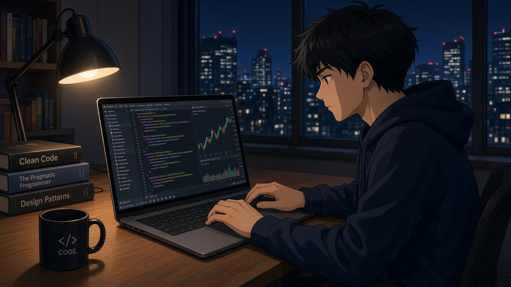

<!-- 动态打字 -->
<h1 align="center">
  
</h1>

<!-- 敲代码 -->

  

 

<!-- 徽标 -->

  &emsp;
  

# 🙋 Hello

嗨，我是 **晟林**。

平时就爱写写代码、捣鼓点东西。能跑就先跑着，跑不通再拆开看看，反正重来也不是一次两次了。

**所谓过往，皆为序章** —— 走过的坑都算数，但不太爱回头纠结。

熬夜是常有的，入迷也是。半成品堆着也不慌，想开新坑的时候自然就开了。日子大概就是这样过的。

💪 **最近在玩:**

&emsp;&emsp;

🧠 **下一步随便看看:**

&emsp;&emsp;稳一点的策略，野一点的想法，少一点废话。

  

# 🚀 Action

  

